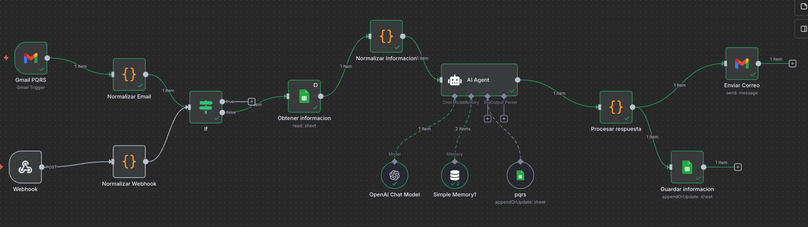
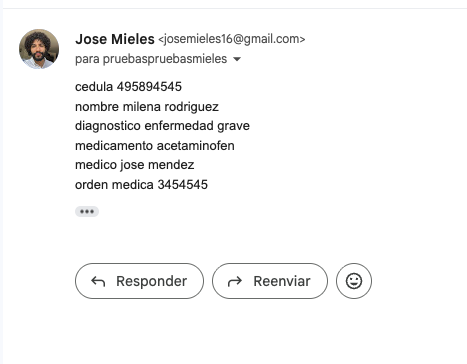
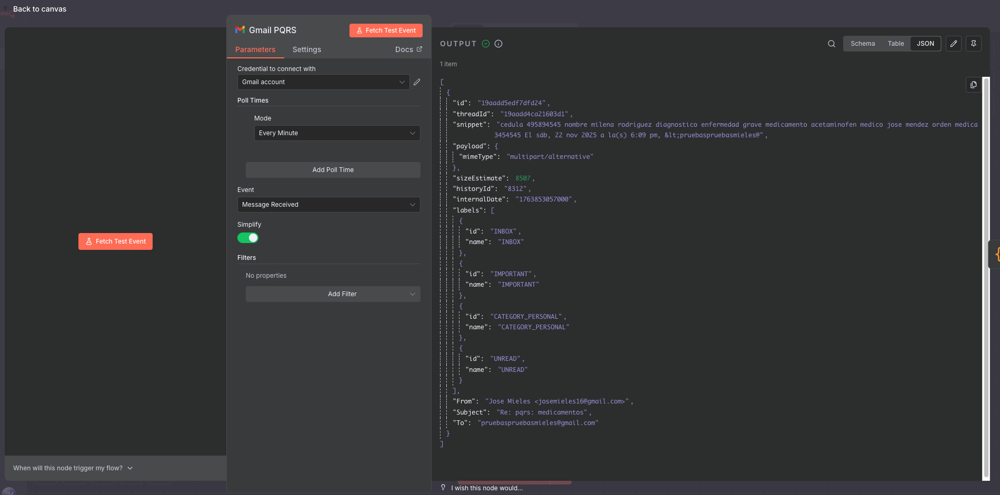
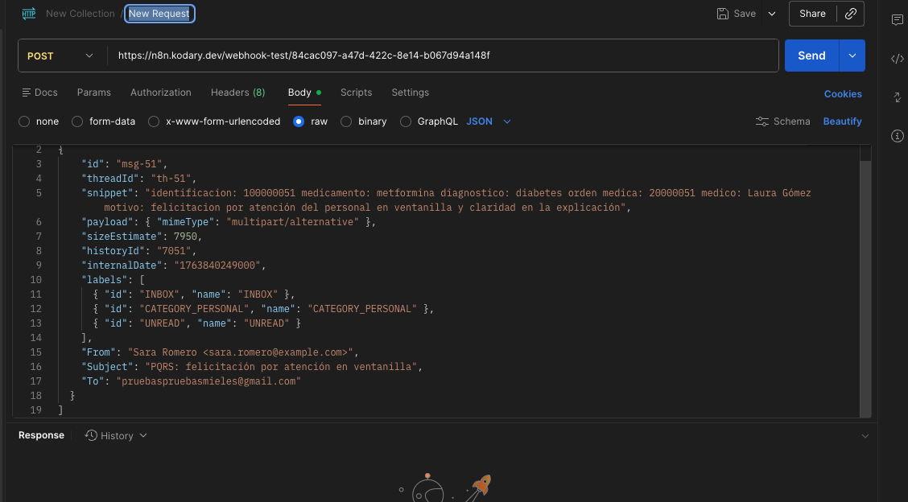
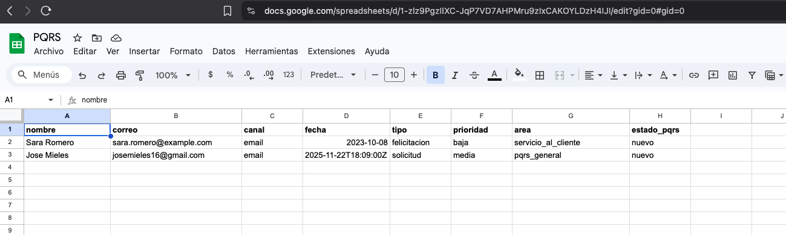
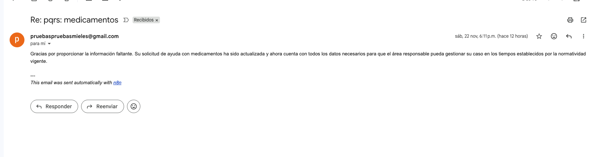

# Prototipo de Automatización de PQRS con n8n, IA y Google Sheets

## Descripción del proyecto

Este proyecto implementa un prototipo de automatización de PQRS (Peticiones, Quejas, Reclamos, Solicitudes y Felicitaciones) para una empresa de servicios en Colombia usando n8n, OpenAI y Google Sheets.

El flujo permite:
- Recibir PQRS desde:
	  - Correos electrónicos (nodo Gmail PQRS, tipo Gmail Trigger).
	  - Un Webhook (por ejemplo, formularios web o pruebas con Postman).
- Normalizar los datos de entrada (nombre, correo, canal, asunto, mensaje).
- Consultar el historial de PQRS del usuario en una hoja de cálculo.
- Usar un AI Agent para:
  - Clasificar el tipo de PQRS.
  - Asignar prioridad y área responsable.
  - Evaluar si faltan datos del usuario (cédula, medicamento, orden médica, etc.).
  - Generar un resumen del caso.
  - Redactar una respuesta inicial para el usuario.
  - Definir y actualizar el estado de la PQRS (nuevo, pendiente_datos, en_proceso, resuelto, cerrado).
- Registrar o actualizar automáticamente el caso en Google Sheets.
- Responder al usuario por correo con la información generada por la IA.

Este prototipo integra servicios reales (Gmail, Google Sheets, API de OpenAI y n8n) y sirve como demostración de un sistema con nivel de madurez tecnológica cercano a TRL 5.


## Diagrama del flujo en n8n

A nivel general, el flujo en n8n sigue estos pasos (usando los nombres reales de los nodos del workflow):
1. **Entrada**
	- **Gmail PQRS**: nodo Gmail Trigger que captura nuevos correos recibidos en el buzón de PQRS.
	- **Webhook**: nodo HTTP que permite recibir PQRS desde aplicaciones externas o desde Postman.

2.	**Normalización inicial**
	- **Normalizar Email**: nodo de Function/Code que extrae y unifica los campos nombre, correo, canal, asunto y mensaje a partir del correo.
	- **Normalizar Webhook**: nodo de Function/Code que hace lo mismo, pero para las peticiones que entran por Webhook.
	- Ambos flujos convergen en un nodo If, que detecta el origen del dato pero deja la estructura normalizada.

3.	**Consulta de historial en la hoja**
	- **Obtener informacion** (read sheet): consulta en Google Sheets si ya existe una PQRS previa para ese correo y devuelve, por ejemplo, el estado anterior del caso y otros datos asociados.

4.	**Preparación para el agente de IA**
	- **Normalizar Informacion1: combina la información del mensaje (nombre, correo, canal, asunto, mensaje) con los datos que vienen de la hoja (estado previo, fechas, etc.) y construye un único objeto JSON que será la entrada del AI Agent.

5.	**Agente de IA**
	- **AI Agent**:
	  - Usa un OpenAI Chat Model con un prompt especializado en gestión de PQRS.
	  - Utiliza Simple Memory1 para mantener contexto de conversaciones anteriores con el mismo usuario.
	  - Usa la herramienta pqrs (Google Sheets, operación appendOrUpdate: sheet) para consultar y actualizar el registro del caso.
	  - Devuelve un objeto JSON con:
	    - tipo, prioridad, area,
	    - resumen, respuesta,
	    - estado_pqrs, datos_faltantes,
	    - y un subobjeto registro_pqrs preparado para guardarse en la hoja.

6.	**Procesamiento de salida**
	- **Procesar respuesta**: nodo de Function/Code que adapta el JSON de la IA al formato exacto que se necesita:
	  - Por un lado, los campos que se almacenan en la hoja de cálculo (correo, nombre, canal, fecha, tipo, prioridad, área, estado_pqrs, resumen, etc.).
	  - Por otro, el cuerpo del mensaje que se va a enviar por correo al usuario.

7.	**Persistencia y respuesta al usuario**
	- **Guardar informacion** (appendOrUpdate row in sheet): crea o actualiza la fila correspondiente en Google Sheets usando el correo como llave.
	- **Enviar Correo** (send: message de Gmail): envía al usuario la respuesta generada por el AI Agent, incluyendo el resumen del caso y los datos faltantes que debe completar.



## Capturas del prototipo

### 1. Ejemplo de correo recibido




### 2. Consumo de API por medio de POSTMAN



### 3. Actualización en Google Sheets



### 4. Respuesta enviada al usuario




## Requisitos del proyecto

**Entorno**
- Una instancia de n8n (Cloud, Docker o Desktop).
- Acceso a internet desde n8n para llamar a la API de OpenAI y a los servicios de Google.

**Credenciales y servicios externos**
1.	**OpenAI**
	- Cuenta de OpenAI.
	- API Key válida.
	- Credencial configurada en n8n para el nodo OpenAI Chat Model / AI Agent.
2.	**Google (Gmail y Sheets)**
	- Cuenta de Google con acceso a Gmail y Google Sheets.
	- Credencial de Google en n8n (OAuth2 o Service Account) con permisos para:
	  - Leer correos del buzón de PQRS (nodo Gmail PQRS).
	  - Leer y escribir en la hoja de cálculo usada como base de datos de PQRS (nodos Obtener informacion y Guardar informacion).
	- Hoja de Google Sheets creada previamente, con al menos estas columnas:
	  - correo
	  - nombre
	  - canal
	  - fecha
	  - tipo
	  - prioridad
	  - area
	  - estado_pqrs
	  - resumen
	  - (opcionales) datos_faltantes, palabras_clave, ultima_respuesta, etc.
3.	**Herramientas de prueba (opcional)**
	- Postman u otra herramienta para enviar solicitudes al nodo Webhook.
	- Cuenta de correo de prueba para simular PQRS de usuarios.

## Ejemplo del json del consumo del Webhook mediante API

```json
[{
    "id": "msg-51",
    "threadId": "th-51",
    "snippet": "identificacion: 100000051 medicamento: metformina diagnostico: diabetes orden medica: 20000051 medico: Laura Gómez motivo: felicitacion por atención del personal en ventanilla y claridad en la explicación",
    "payload": { "mimeType": "multipart/alternative" },
    "sizeEstimate": 7950,
    "historyId": "7051",
    "internalDate": "1763840249000",
    "labels": [
      { "id": "INBOX", "name": "INBOX" },
      { "id": "CATEGORY_PERSONAL", "name": "CATEGORY_PERSONAL" },
      { "id": "UNREAD", "name": "UNREAD" }
    ],
    "From": "Sara Romero <sara.romero@example.com>",
    "Subject": "PQRS: felicitación por atención en ventanilla",
    "To": "pruebaspruebasmieles@gmail.com"
  }]
```

## Ejemplo de entrada al AI Agent

```json
{
  "nombre": "Ana López",
  "correo": "ana.lopez@example.com",
  "canal": "email",
  "asunto": "Medicamentos para mi mamá",
  "mensaje": "Necesito ayuda con la autorización de un medicamento para mi mamá con artritis."
}
```
## Ejemplo de salida del AI Agent
```json
{
  "tipo": "solicitud",
  "prioridad": "media",
  "area": "pqrs_general",
  "resumen": "La usuaria solicita apoyo para gestionar la autorización de un medicamento para su mamá.",
  "respuesta": "Gracias por contactarnos. Hemos recibido su solicitud...",
  "estado_pqrs": "pendiente_datos",
  "datos_faltantes": ["cedula", "tipo_medicamento", "orden_medica"],
  "registro_pqrs": {
    "nombre": "Ana López",
    "correo": "ana.lopez@example.com",
    "canal": "email",
    "fecha": "2025-11-22T15:30:00Z",
    "tipo": "solicitud",
    "prioridad": "media",
    "area": "pqrs_general",
    "estado_pqrs": "pendiente_datos"
  }
}
```
## Pasos para importar el workflow en n8n
1.	Obtener el archivo del workflow (por ejemplo workflow-pqrs-n8n.json).
2.	En n8n ir a Workflows → Import from file y seleccionar el archivo JSON.
3.	Configurar credenciales en los nodos: Gmail PQRS, Enviar Correo, Obtener informacion, Guardar informacion, tool pqrs y AI Agent.
4.	Seleccionar el documento y la hoja correctos en los nodos de Google Sheets y verificar el mapeo de columnas.
5.	Configurar los triggers (Gmail PQRS y Webhook) y hacer pruebas de envío de PQRS desde correo y desde Postman.
6.	Revisar que la hoja se actualiza y que el usuario recibe el correo de respuesta del AI Agent.
7.	Activar el workflow en n8n para que quede ejecutándose de forma automática.

## Notas adicionales
- El AI Agent devuelve siempre un JSON que incluye el campo estado_pqrs, lo que permite saber si el caso está nuevo, pendiente_datos, en_proceso, resuelto o cerrado.
- El flujo puede ampliarse en el futuro con:
- Integración de otros canales de atención (WhatsApp, Telegram, Facebook Messenger).
- Migración de la base de datos de PQRS a un motor relacional o NoSQL.
- Alertas automáticas a los responsables cuando un caso lleve demasiado tiempo sin cambiar de estado.

## Pruebas realizadas

Se ejecutaron más de 60 casos de prueba de PQRS, variando:

- Tipo de PQRS: peticiones, quejas, reclamos, solicitudes y felicitaciones.
- Diferentes prioridades (alta, media, baja) según el contenido del mensaje.
- Canales de entrada: correo electrónico (Gmail PQRS) y Webhook (simulado con Postman).
- Casos con datos completos y casos con datos faltantes (cedula, tipo de medicamento, orden médica, etc.).

En todos los casos se verificó que:

- El flujo se ejecuta correctamente en n8n.
- La hoja de Google Sheets se actualiza (creación o actualización de filas).
- El usuario recibe un correo de respuesta generado por el AI Agent.